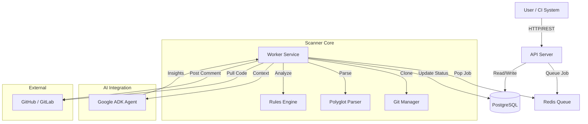

# System Architecture

## Overview

Code Security Auditor is a distributed system designed to perform scalable, automated security analysis of source code repositories. It combines static analysis (SAST) with AI-powered enhancements to detect vulnerabilities, secrets, and compliance issues.

## System Diagram

## Components

### 1. API Server (`cmd/api`)
- **Role**: Entry point for users and webhooks.
- **Tech**: Go, Gin Framework.
- **Responsibilities**:
    - Authentication & Authorization.
    - Rate Limiting.
    - Request validation.
    - Job enqueuing (via Asynq/Redis).
    - Data persistence (PostgreSQL).

### 2. Worker Service (`cmd/worker`)
- **Role**: Asynchronous task processor.
- **Tech**: Go, Asynq.
- **Responsibilities**:
    - Processing scan jobs from Redis.
    - Executing Git operations (Clone/Diff).
    - Running the Scanner Pipeline.
    - interacting with AI Agent.
    - Generating reports.

### 3. Database (`PostgreSQL`)
- **Role**: Primary persistent store.
- **Schema**:
    - `users`: Account information.
    - `repositories`: Monitored configs.
    - `scans`: History of scan executions.
    - `vulnerabilities`: Detected issues.
    - `audit_logs`: System activity.

### 4. Message Queue (`Redis`)
- **Role**: Task queue and cache.
- **Tech**: Redis, Asynq.
- **Functions**:
    - Reliability layer for scan jobs.
    - Retry mechanism.
    - Ephemeral caching for rate limiters.

### 5. AI Agent (`Google ADK`)
- **Role**: Intelligent analysis enhancement.
- **Functions**:
    - False positive reduction.
    - Fix suggestion generation.
    - Code context understanding.

## Data Flow

### Scan Workflow
1. **Trigger**: User POSTs to `/scans` or Webhook event occurs.
2. **Queue**: API creates `Scan` record (status: `queued`) and pushes job to Redis.
3. **Process**: Worker claims job.
4. **Clone**: Git Manager clones repo to temp volume.
5. **Parse**: Parser constructs AST and identifies file types.
6. **Analyze**: Analyzer runs regex patterns and rules against AST.
7. **AI Verify**: (Optional) High-severity findings sent to AI for verification.
8. **Report**: Results saved to DB; notifications sent via Webhooks/GitHub.

## Security Considerations

- **Secrets Management**: No secrets stored in code. Environment variables used for all sensitive keys.
- **Sandboxing**: Scans run in ephemeral containers (planned feature).
- **Input Validation**: Strict validation on all API inputs to prevent injection.
- **Encryption**: TLS for all data in transit. At-rest encryption for DB volumes recommended.

## Scalability

- **Horizontal Scaling**:
    - **API**: Stateless, can scale behind load balancer.
    - **Worker**: Can scale independently based on queue depth.
- **Database**:
    - Connection pooling.
    - Read replicas for high-traffic reporting.
- **Redis**:
    - Cluster mode for high availability.
