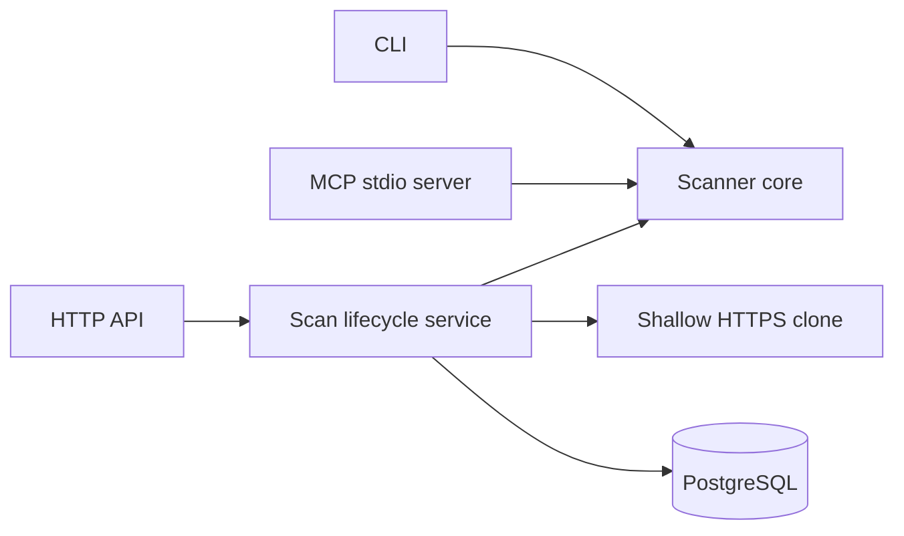

# Architecture

Bastion has one scanner core and three thin entry points.

## Scanner core

`internal/scanner` walks bounded source files and applies deterministic rules.
It returns findings with stable fingerprints. Inline suppression is parsed
before findings leave the scanner.

The rules are fast pattern-based checks. They do not build a complete
interprocedural data-flow graph, so findings require developer review.

## CLI

`cmd/cli` scans a local path and emits text, JSON, or SARIF. It needs no network,
database, account, or API key.

## MCP

`cmd/mcp` exposes one read-only stdio tool, `bastion_scan`. A configured root,
path containment checks, symlink checks, and file limits bound agent access.
Optional baseline fingerprints produce a delta in the same response.

## API

`cmd/api` accepts authenticated scan requests. The lifecycle service:

1. validates a public HTTPS repository URL against configured hosts;
2. creates a pending PostgreSQL record;
3. clones and scans asynchronously inside the API process;
4. persists findings and fingerprints;
5. serves status, findings, cancellation, and baseline comparison.

The prior completed scan of the same repository is the automatic delta
baseline. An explicit completed scan from that repository may be selected.

## Trust boundaries

- CLI and MCP keep code local.
- MCP never writes through its tool contract.
- API repository URLs are untrusted input.
- API keys protect `/api/v1`; health routes are public.
- Database credentials and API keys come from configuration or environment.

## Deliberate non-features

There is no hosted control plane, UI, webhook processing, automatic remediation,
AI verdict engine, distributed worker, or scan sandbox. Those should not appear
in deployment claims until their security properties are implemented and
tested.
